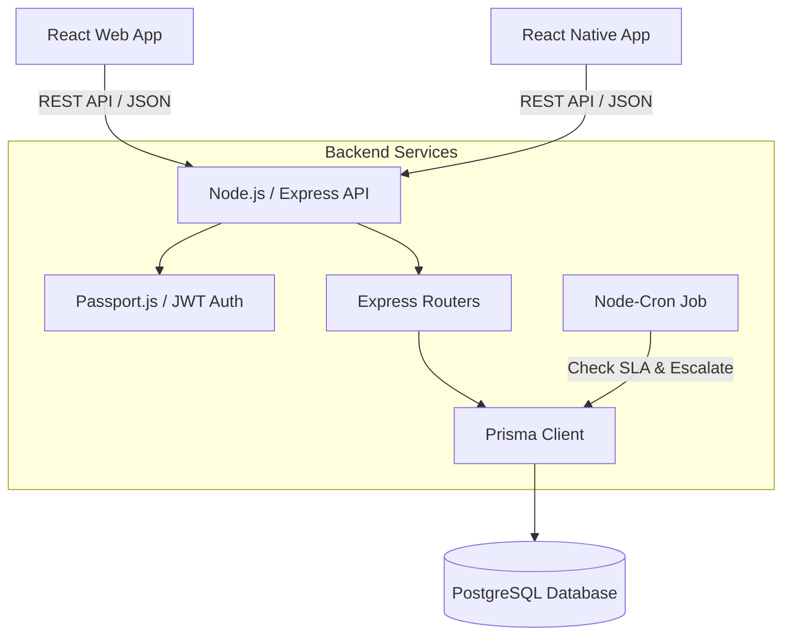

# System Architecture
## Smart Maintenance Request & Escalation System

### 1. High-Level Architecture
The system follows a standard modern 3-tier architecture:
- **Presentation Layer (Clients)**: React Web App (`frontend`) and React Native Mobile App (`MyApp`).
- **Application Layer (API)**: Node.js/Express server (`backend`) handling business logic and RBAC.
- **Data Layer**: PostgreSQL database accessed via Prisma ORM.

### 2. Authentication & Authorization Flow
1. Client sends `email` and `password` to `/api/auth/login`.
2. Backend verifies using `argon2` and `passport-local`.
3. Backend generates a JWT token containing the user's `id` and `role`.
4. Client stores the token (`localStorage` for Web, `SecureStore` for Mobile).
5. All subsequent requests include `Authorization: Bearer <token>`.
6. `authMiddleware.js` verifies the token using `passport-jwt` and enforces Role-Based Access Control (RBAC) via `requireRole(['EMPLOYEE', 'ADMIN'])`.

### 3. Background Escalation Job
To fulfill the requirement of automatic SLA escalations without relying on complex message queues for the MVP:
- A `node-cron` scheduled task runs periodically (e.g., every 10 seconds).
- It queries the database for requests where `status IN ('PENDING', 'IN_PROGRESS')` AND `createdAt < (NOW - SLA_THRESHOLD)`.
- For each matching request, it performs a Prisma `$transaction` to:
  1. Update the request status to `ESCALATED`.
  2. Insert a new record into `EscalationLog`.
- *(Future Phase 5)*: This job will also trigger the Email Service to notify the Admin.

### 4. Client-Side Role-Based Routing
To maintain security and UX, the clients dynamically adapt based on the user's role.
- **Web (`frontend/src/App.tsx`)**: Conditional rendering at the route level. If `user.role === 'ADMIN'`, `<Dashboard />` renders `<AdminDashboard />`; otherwise it renders `<EmployeeDashboard />`.
- **Mobile (`MyApp/navigation/AppNavigator.tsx`)**: The React Navigation Stack conditionally includes the `AdminDashboardScreen` or `EmployeeDashboardScreen` based on `user.role`.

### 5. Deployment Strategy (Future)
- **Database**: Supabase (PostgreSQL).
- **Backend API**: Render, Heroku, or AWS EC2.
- **Web App**: Vercel or Netlify (static build).
- **Mobile App**: Expo Application Services (EAS) for OTA updates and App Store deployment.
