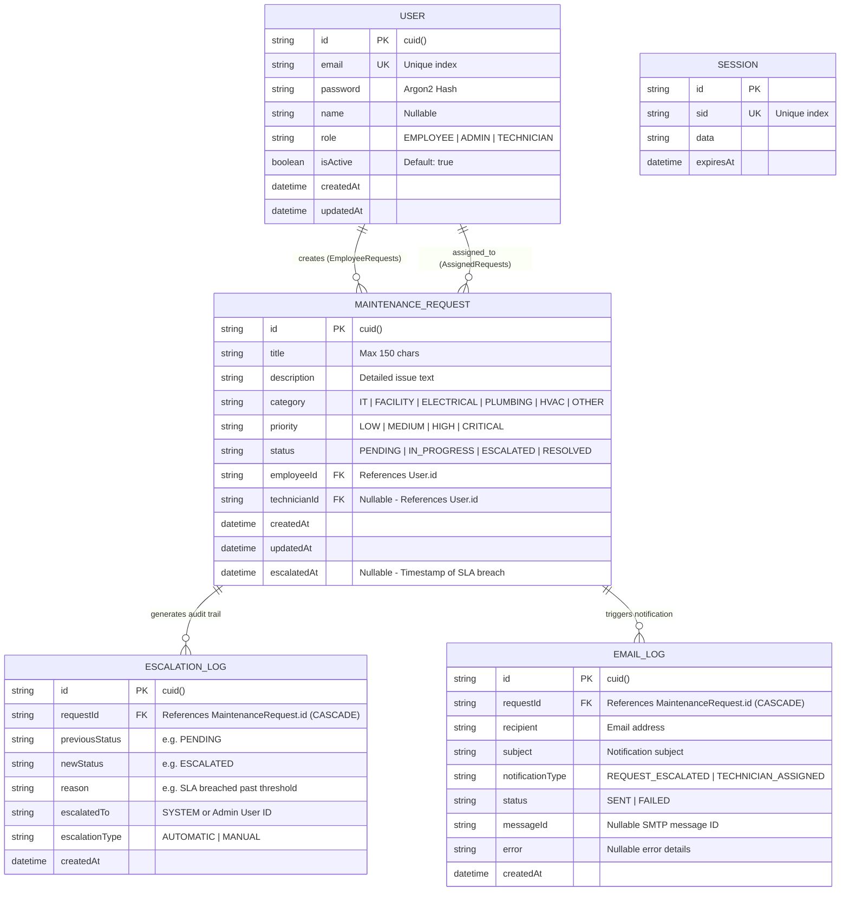
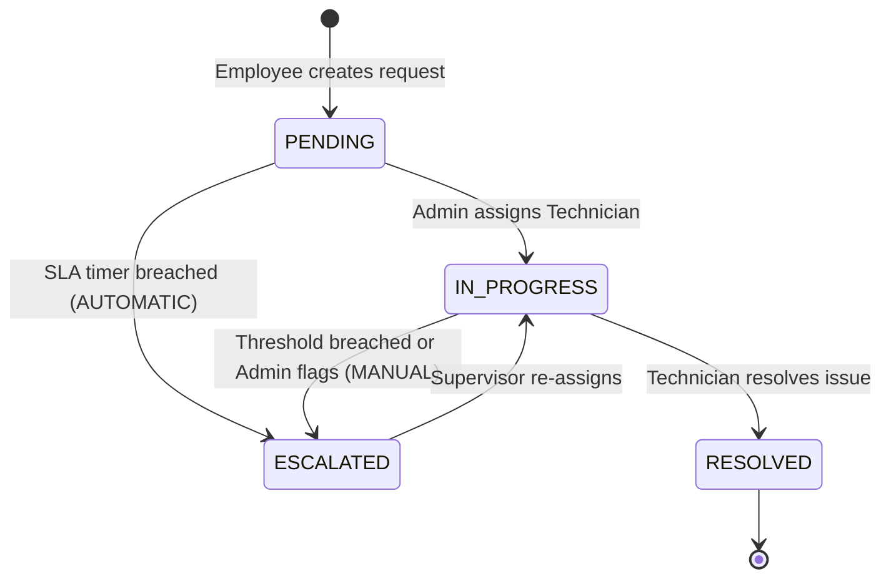

# Database Low-Level Design (LLD / LDL) & Architectural Specification
## TruliaCare: Smart Maintenance Request & Escalation System

---

## 1. Executive Summary for Judges

The **TruliaCare Database Engine** is designed using **PostgreSQL** and **Prisma ORM (v7.9)**. It provides a robust, scalable, type-safe data architecture specifically optimized for:
1. **Instant Ticket Creation & Lifecycle Tracking**: Frictionless request submission and live status transitions.
2. **Unified Role-Based Access Control (RBAC)**: Single-table polymorphic role model supporting Employees, Admins, and Technicians without unnecessary join overhead.
3. **Automated & Manual SLA Escalation Auditing**: Immutable escalation logs recording state transitions, reasons, timestamps, and target authorities.
4. **Notification & Email Observability**: Complete delivery tracking of escalation emails (`SENT`/`FAILED`) for transparency and accountability.

---

## 2. Entity-Relationship Diagram (ERD)

---

## 3. Detailed Data Dictionary / Logical Data Layout (LDL)

### 3.1 `User` Table (Core Authentication & RBAC)
Stores credentials, profile details, and role classifications across the entire organization.

| Field Name | Data Type | Constraints | Default | Description |
|---|---|---|---|---|
| `id` | `VARCHAR(30)` | **PRIMARY KEY** | `cuid()` | Unique collision-resistant user identifier |
| `email` | `VARCHAR(150)` | **UNIQUE**, NOT NULL | — | User's work email address (used for login & notifications) |
| `password` | `VARCHAR(255)` | NOT NULL | — | Secure password hashed with **Argon2** algorithm |
| `name` | `VARCHAR(100)` | NULLABLE | `NULL` | Full name of the user |
| `role` | `VARCHAR(20)` | NOT NULL | `'EMPLOYEE'` | Role identifier: `'EMPLOYEE'`, `'ADMIN'`, `'TECHNICIAN'` |
| `isActive` | `BOOLEAN` | NOT NULL | `true` | Account active state toggle |
| `createdAt` | `TIMESTAMP(3)` | NOT NULL | `now()` | Account creation timestamp |
| `updatedAt` | `TIMESTAMP(3)` | NOT NULL | Auto-update | Last profile update timestamp |

---

### 3.2 `MaintenanceRequest` Table (Core Ticket Engine)
Central table tracking issue reports, categories, technician assignment, priority, and escalation status.

| Field Name | Data Type | Constraints | Default | Description |
|---|---|---|---|---|
| `id` | `VARCHAR(30)` | **PRIMARY KEY** | `cuid()` | Unique ticket reference number |
| `title` | `VARCHAR(150)` | NOT NULL | — | Brief summary of the maintenance issue |
| `description` | `TEXT` | NOT NULL | — | Detailed problem description |
| `category` | `VARCHAR(50)` | NOT NULL | — | Issue classification: `IT`, `FACILITY`, `ELECTRICAL`, `PLUMBING`, `HVAC`, `OTHER` |
| `priority` | `VARCHAR(20)` | NOT NULL | — | Urgency level: `LOW`, `MEDIUM`, `HIGH`, `CRITICAL` |
| `status` | `VARCHAR(20)` | NOT NULL, **INDEXED** | `'PENDING'` | Ticket lifecycle status: `PENDING`, `IN_PROGRESS`, `ESCALATED`, `RESOLVED` |
| `employeeId` | `VARCHAR(30)` | **FOREIGN KEY**, **INDEXED** | — | References `User.id` (Creator of the ticket) |
| `technicianId` | `VARCHAR(30)` | **FOREIGN KEY**, **INDEXED**, NULLABLE | `NULL` | References `User.id` (Assigned servicing technician) |
| `createdAt` | `TIMESTAMP(3)` | NOT NULL | `now()` | Timestamp when ticket was created |
| `updatedAt` | `TIMESTAMP(3)` | NOT NULL | Auto-update | Timestamp when ticket was last modified |
| `escalatedAt` | `TIMESTAMP(3)` | NULLABLE | `NULL` | Exact timestamp when automated/manual escalation occurred |

---

### 3.3 `EscalationLog` Table (Audit Trail & SLA Compliance)
Immutable log recording every state transition to `ESCALATED`, providing complete historical auditability.

| Field Name | Data Type | Constraints | Default | Description |
|---|---|---|---|---|
| `id` | `VARCHAR(30)` | **PRIMARY KEY** | `cuid()` | Unique log identifier |
| `requestId` | `VARCHAR(30)` | **FOREIGN KEY**, **INDEXED** | — | References `MaintenanceRequest.id` (`ON DELETE CASCADE`) |
| `previousStatus`| `VARCHAR(20)` | NOT NULL | — | Status before escalation (e.g. `'PENDING'`, `'IN_PROGRESS'`) |
| `newStatus` | `VARCHAR(20)` | NOT NULL | — | Status after escalation (e.g. `'ESCALATED'`) |
| `reason` | `TEXT` | NULLABLE | `NULL` | Reason for escalation (e.g. SLA breach, manual supervisor flag) |
| `escalatedTo` | `VARCHAR(100)` | NULLABLE | `NULL` | Target authority role or user ID (`'SYSTEM'`, Admin ID) |
| `escalationType`| `VARCHAR(20)` | NOT NULL | `'AUTOMATIC'`| Trigger mechanism: `'AUTOMATIC'` (timer) or `'MANUAL'` (admin action) |
| `createdAt` | `TIMESTAMP(3)` | NOT NULL | `now()` | Timestamp when the escalation occurred |

---

### 3.4 `EmailLog` Table (Notification Observability & Delivery Tracking)
Tracks all automated outbound email notifications triggered by status changes and escalations.

| Field Name | Data Type | Constraints | Default | Description |
|---|---|---|---|---|
| `id` | `VARCHAR(30)` | **PRIMARY KEY** | `cuid()` | Unique email log identifier |
| `requestId` | `VARCHAR(30)` | **FOREIGN KEY**, **INDEXED** | — | References `MaintenanceRequest.id` (`ON DELETE CASCADE`) |
| `recipient` | `VARCHAR(150)` | NOT NULL | — | Recipient email address |
| `subject` | `VARCHAR(255)` | NOT NULL | — | Email notification subject line |
| `notificationType`| `VARCHAR(50)`| NOT NULL | `'REQUEST_ESCALATED'` | Event type: `'REQUEST_ESCALATED'`, `'TECHNICIAN_ASSIGNED'` |
| `status` | `VARCHAR(20)` | NOT NULL, **INDEXED** | — | Delivery status: `'SENT'`, `'FAILED'` |
| `messageId` | `VARCHAR(100)` | NULLABLE | `NULL` | SMTP gateway message ID for tracking |
| `error` | `TEXT` | NULLABLE | `NULL` | Error details if delivery failed |
| `createdAt` | `TIMESTAMP(3)` | NOT NULL | `now()` | Dispatch timestamp |

---

### 3.5 `Session` Table (Stateless Auth Session Store)

| Field Name | Data Type | Constraints | Description |
|---|---|---|---|
| `id` | `VARCHAR(30)` | **PRIMARY KEY** | Session ID |
| `sid` | `VARCHAR(150)` | **UNIQUE** | Unique session token |
| `data` | `TEXT` | NOT NULL | Serialized session metadata |
| `expiresAt` | `TIMESTAMP(3)` | NOT NULL | Expiry timestamp |

---

## 4. Performance & Indexing Strategy

To guarantee sub-millisecond query responses on dashboard filters and automated SLA scans:

| Index Name | Table | Columns | Purpose |
|---|---|---|---|
| `MaintenanceRequest_status_idx` | `MaintenanceRequest` | `status` | Instant filtering on Pending, In Progress, Escalated, Resolved |
| `MaintenanceRequest_employeeId_idx` | `MaintenanceRequest` | `employeeId` | Fast retrieval of "My Submitted Tickets" for employees |
| `MaintenanceRequest_technicianId_idx`| `MaintenanceRequest` | `technicianId` | Fast retrieval of assigned workload for technicians |
| `MaintenanceRequest_category_idx` | `MaintenanceRequest` | `category` | High-speed category filtering on Admin dashboard |
| `EscalationLog_requestId_idx` | `EscalationLog` | `requestId` | Instant history lookups on ticket timeline views |
| `EmailLog_requestId_idx` | `EmailLog` | `requestId` | Complete email audit history per ticket |
| `EmailLog_status_idx` | `EmailLog` | `status` | Querying failed notifications for retry queueing |

---

## 5. Ticket Lifecycle & State Machine

---

## 6. Key Pitch Points for Judges (Why Our Database Design Stands Out)

1. **Clean Polymorphic Relationships**:
   - Instead of maintaining 3 separate tables (`Employee`, `Admin`, `Technician`) with messy joins, our unified `User` model with named Prisma relations (`EmployeeRequests` and `AssignedRequests`) enables seamless role flexibility with zero data duplication.

2. **CUID Security & Scalability**:
   - Uses collision-resistant, URL-safe **CUIDs** instead of predictable auto-increment integers, preventing ID enumeration attacks and enabling distributed horizontal scaling.

3. **Enterprise SLA Auditing & Observability**:
   - Every escalation creates an immutable `EscalationLog` and an observable `EmailLog`. Nothing is lost, and supervisors have full forensic visibility into response bottlenecks.

4. **Production-Ready Cascading Deletions**:
   - Foreign keys utilize `ON DELETE CASCADE` on audit and email logs to maintain referential integrity without orphan records.
