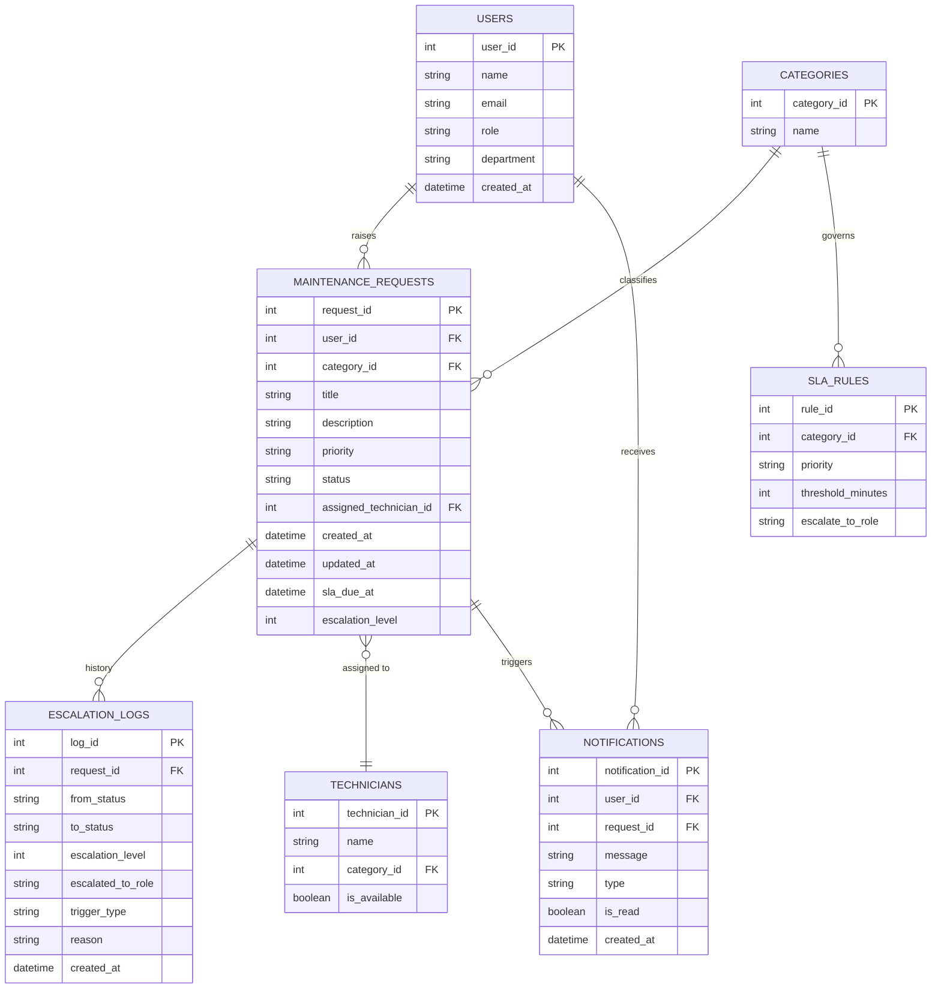

# Database Schema PRD
## Smart Maintenance Request & Escalation System

**Context:** 3-hour mini-hackathon build. This document specifies the data model needed to satisfy the MVP (Employee login & request submission → Request tracking → Escalation logic → Admin panel) plus hooks for the optional bonus features (notifications, dashboard filters, auto-assignment, SLA timers).

---

## 1. Design Assumptions

- **User auth:** Designed for the recommended "Simplified User Simulation" (static/mock users with a `role` field). The same tables work unchanged if a team later adds real auth (JWT/Firebase) — just add a `password_hash` column to `users`.
- **Database engine:** Written as ANSI-ish SQL that runs on PostgreSQL/MySQL with minor tweaks; SQLite and MongoDB equivalents are noted separately since both are in the recommended stack list.
- **Priority:** Functionality > completeness. Section 3 marks which tables are **Core (MVP)** vs **Bonus** — build core first, add bonus tables only if time remains.

---

## 2. Entity-Relationship Diagram



---

## 3. Table Definitions

### 3.1 `users` — **Core**
Backs employee/admin login simulation (matches the sample JSON in the brief).

| Column | Type | Constraints | Notes |
|---|---|---|---|
| user_id | INTEGER | PK, auto-increment | |
| name | VARCHAR(100) | NOT NULL | |
| email | VARCHAR(150) | UNIQUE | optional if using mock data only |
| role | VARCHAR(20) | NOT NULL, CHECK IN ('employee','admin') | drives frontend routing/permissions |
| department | VARCHAR(50) | NULL | e.g. IT, Facilities — useful for auto-assignment |
| created_at | TIMESTAMP | DEFAULT now() | |

### 3.2 `categories` — **Core**
Normalizes the issue type ("internet not working", "AC fault", etc.) instead of a free-text field, so the admin dashboard can filter/group cleanly.

| Column | Type | Constraints |
|---|---|---|
| category_id | INTEGER | PK, auto-increment |
| name | VARCHAR(50) | NOT NULL, UNIQUE — e.g. IT, Facilities, Infrastructure, Electrical |

*Time-saver:* if you're really tight on time, skip this table and store `category` as a plain VARCHAR directly on `maintenance_requests`. You lose referential integrity but save a join.

### 3.3 `maintenance_requests` — **Core**
The central ticket table — everything else hangs off this.

| Column | Type | Constraints | Notes |
|---|---|---|---|
| request_id | INTEGER | PK, auto-increment | |
| user_id | INTEGER | FK → users.user_id, NOT NULL | who raised it |
| category_id | INTEGER | FK → categories.category_id | nullable if using free-text category |
| title | VARCHAR(150) | NOT NULL | short summary |
| description | TEXT | NOT NULL | full issue description |
| priority | VARCHAR(20) | DEFAULT 'Medium', CHECK IN ('Low','Medium','High','Critical') | feeds SLA threshold lookup |
| status | VARCHAR(20) | NOT NULL, DEFAULT 'Pending', CHECK IN ('Pending','In Progress','Escalated','Resolved') | the four states named in the brief |
| assigned_technician_id | INTEGER | FK → technicians.technician_id, NULL | bonus: auto-assignment |
| escalation_level | INTEGER | DEFAULT 0 | increments each time it escalates |
| sla_due_at | TIMESTAMP | NULL | computed at creation: `created_at + threshold` |
| created_at | TIMESTAMP | DEFAULT now() | |
| updated_at | TIMESTAMP | DEFAULT now(), auto-update on change | |

### 3.4 `escalation_logs` — **Core**
Required to actually *demonstrate* the escalation flow (not just a status flip) — this table is what makes the escalation logic auditable and demo-able, which directly supports the "Functionality" and "Innovation" scoring criteria.

| Column | Type | Constraints | Notes |
|---|---|---|---|
| log_id | INTEGER | PK, auto-increment | |
| request_id | INTEGER | FK → maintenance_requests.request_id, NOT NULL | |
| from_status | VARCHAR(20) | NOT NULL | |
| to_status | VARCHAR(20) | NOT NULL | |
| escalation_level | INTEGER | NOT NULL | snapshot at time of log |
| escalated_to_role | VARCHAR(20) | e.g. 'admin' | next-level authority |
| trigger_type | VARCHAR(10) | CHECK IN ('timer','manual') | satisfies "simulated based on simple logic or timer triggers" |
| reason | VARCHAR(255) | NULL | e.g. "SLA breached (30 min)" or "Manually escalated by admin" |
| created_at | TIMESTAMP | DEFAULT now() | |

### 3.5 `technicians` — **Bonus** (auto-assignment)

| Column | Type | Constraints |
|---|---|---|
| technician_id | INTEGER | PK, auto-increment |
| name | VARCHAR(100) | NOT NULL |
| category_id | INTEGER | FK → categories.category_id — their specialty |
| is_available | BOOLEAN | DEFAULT true |

Auto-assignment logic: on request creation (or escalation), pick the first `is_available = true` technician whose `category_id` matches the request's category.

### 3.6 `notifications` — **Bonus** (email/push on escalation)

| Column | Type | Constraints |
|---|---|---|
| notification_id | INTEGER | PK, auto-increment |
| user_id | INTEGER | FK → users.user_id — recipient |
| request_id | INTEGER | FK → maintenance_requests.request_id |
| message | VARCHAR(255) | NOT NULL |
| type | VARCHAR(10) | CHECK IN ('email','push','in_app') |
| is_read | BOOLEAN | DEFAULT false |
| created_at | TIMESTAMP | DEFAULT now() |

### 3.7 `sla_rules` — **Bonus** (SLA-based timers)

| Column | Type | Constraints |
|---|---|---|
| rule_id | INTEGER | PK, auto-increment |
| category_id | INTEGER | FK → categories.category_id |
| priority | VARCHAR(20) | CHECK IN ('Low','Medium','High','Critical') |
| threshold_minutes | INTEGER | NOT NULL — e.g. 30, 60, 240 |
| escalate_to_role | VARCHAR(20) | e.g. 'admin' |

If you skip this table for time, hardcode a single threshold constant (e.g. 30 minutes) in application code instead of per-category rules.

---

## 4. Escalation Logic (implementation notes)

Two ways to satisfy *"can be simulated based on simple logic or timer triggers"* — pick based on remaining time:

1. **Timer-based (more impressive, still simple):** On request creation, set `sla_due_at = created_at + threshold` (from `sla_rules`, or a hardcoded constant). A scheduled job — or just a check that runs whenever the admin dashboard loads / a `/check-escalations` endpoint is hit — finds requests where `status NOT IN ('Resolved','Escalated')` and `sla_due_at < now()`, then: sets `status = 'Escalated'`, increments `escalation_level`, and inserts a row into `escalation_logs` with `trigger_type = 'timer'`.
2. **Manual flag (fastest to build):** Admin UI has an "Escalate" button that does the same status/log update with `trigger_type = 'manual'`. Build this first — it guarantees a working demo even if the timer logic runs out of time.

Doing both (manual button as the guaranteed path, timer check as the "wow" bonus) is the safest use of 3 hours.

---

## 5. Reference SQL (PostgreSQL/MySQL)

```sql
CREATE TABLE users (
    user_id      SERIAL PRIMARY KEY,
    name         VARCHAR(100) NOT NULL,
    email        VARCHAR(150) UNIQUE,
    role         VARCHAR(20) NOT NULL CHECK (role IN ('employee','admin')),
    department   VARCHAR(50),
    created_at   TIMESTAMP DEFAULT CURRENT_TIMESTAMP
);

CREATE TABLE categories (
    category_id  SERIAL PRIMARY KEY,
    name         VARCHAR(50) NOT NULL UNIQUE
);

CREATE TABLE technicians (
    technician_id SERIAL PRIMARY KEY,
    name          VARCHAR(100) NOT NULL,
    category_id   INTEGER REFERENCES categories(category_id),
    is_available  BOOLEAN DEFAULT true
);

CREATE TABLE maintenance_requests (
    request_id              SERIAL PRIMARY KEY,
    user_id                 INTEGER NOT NULL REFERENCES users(user_id),
    category_id             INTEGER REFERENCES categories(category_id),
    title                   VARCHAR(150) NOT NULL,
    description             TEXT NOT NULL,
    priority                VARCHAR(20) DEFAULT 'Medium' CHECK (priority IN ('Low','Medium','High','Critical')),
    status                  VARCHAR(20) NOT NULL DEFAULT 'Pending' CHECK (status IN ('Pending','In Progress','Escalated','Resolved')),
    assigned_technician_id  INTEGER REFERENCES technicians(technician_id),
    escalation_level        INTEGER DEFAULT 0,
    sla_due_at              TIMESTAMP,
    created_at              TIMESTAMP DEFAULT CURRENT_TIMESTAMP,
    updated_at              TIMESTAMP DEFAULT CURRENT_TIMESTAMP
);

CREATE TABLE escalation_logs (
    log_id             SERIAL PRIMARY KEY,
    request_id         INTEGER NOT NULL REFERENCES maintenance_requests(request_id),
    from_status        VARCHAR(20) NOT NULL,
    to_status          VARCHAR(20) NOT NULL,
    escalation_level   INTEGER NOT NULL,
    escalated_to_role  VARCHAR(20),
    trigger_type       VARCHAR(10) CHECK (trigger_type IN ('timer','manual')),
    reason             VARCHAR(255),
    created_at         TIMESTAMP DEFAULT CURRENT_TIMESTAMP
);

CREATE TABLE notifications (
    notification_id SERIAL PRIMARY KEY,
    user_id          INTEGER NOT NULL REFERENCES users(user_id),
    request_id       INTEGER REFERENCES maintenance_requests(request_id),
    message          VARCHAR(255) NOT NULL,
    type             VARCHAR(10) CHECK (type IN ('email','push','in_app')),
    is_read          BOOLEAN DEFAULT false,
    created_at       TIMESTAMP DEFAULT CURRENT_TIMESTAMP
);

CREATE TABLE sla_rules (
    rule_id           SERIAL PRIMARY KEY,
    category_id       INTEGER REFERENCES categories(category_id),
    priority          VARCHAR(20) CHECK (priority IN ('Low','Medium','High','Critical')),
    threshold_minutes INTEGER NOT NULL,
    escalate_to_role  VARCHAR(20)
);

-- Recommended indexes (support the "dashboard with filters" bonus feature)
CREATE INDEX idx_requests_status   ON maintenance_requests(status);
CREATE INDEX idx_requests_user     ON maintenance_requests(user_id);
CREATE INDEX idx_requests_category ON maintenance_requests(category_id, status);
```

**Dialect notes:**
- **SQLite:** replace `SERIAL` with `INTEGER PRIMARY KEY AUTOINCREMENT`; SQLite doesn't enforce `VARCHAR` length or all `CHECK` syntax variants — both still work but are advisory in older SQLite builds.
- **MySQL:** replace `SERIAL` with `INT AUTO_INCREMENT`, and note MySQL only enforces `CHECK` constraints from 8.0.16+.

---

## 6. Seed / Mock Data (matches the sample in the brief)

```sql
INSERT INTO users (user_id, name, email, role, department) VALUES
  (1, 'John Doe', 'john@company.com', 'employee', 'IT'),
  (2, 'Facility Manager', 'fm@company.com', 'admin', 'Facilities');

INSERT INTO categories (category_id, name) VALUES
  (1, 'IT'), (2, 'Facilities'), (3, 'Infrastructure');

INSERT INTO sla_rules (category_id, priority, threshold_minutes, escalate_to_role) VALUES
  (1, 'High', 30, 'admin'),
  (2, 'Medium', 60, 'admin');
```

For the simplified user-simulation path, this same shape (`userId`, `role`, `name`) can just as easily live as a static JS array/mock object instead of a real table — swap in the real table only if time allows.

---

## 7. MongoDB Alternative (if your team picked Node/Express + Mongo)

Same model as an embedded document — denormalizes `escalation_logs` and `category` into the request document, which is often faster to build against in a 3-hour window:

```json
{
  "_id": "req_001",
  "userId": 1,
  "title": "Internet not working",
  "category": "IT",
  "priority": "High",
  "status": "Pending",
  "escalationLevel": 0,
  "assignedTechnicianId": null,
  "slaDueAt": "2026-08-22T12:30:00Z",
  "createdAt": "2026-08-22T12:00:00Z",
  "updatedAt": "2026-08-22T12:00:00Z",
  "escalationLogs": [
    { "fromStatus": "Pending", "toStatus": "Escalated", "triggerType": "timer", "reason": "SLA breached", "createdAt": "2026-08-22T12:31:00Z" }
  ]
}
```

Users can stay a small separate collection (or the static mock array from the brief) since they rarely need to be queried by relationship.

---

## 8. Build Order for a 3-Hour Window

1. `users` (mock array) + `maintenance_requests` (Pending/status field only) → employee can submit, admin can view. *(This alone is a demoable MVP.)*
2. Add `status` transitions + `escalation_logs` with a **manual** "Escalate" button.
3. Add `categories` + dashboard filters (Pending/In Progress/Escalated/Resolved).
4. If time remains: `sla_rules` + timer-based auto-escalation, then `technicians` (auto-assign) and `notifications` last — these are the 10%-weighted "innovation" bonus, not the 40%-weighted core functionality.
